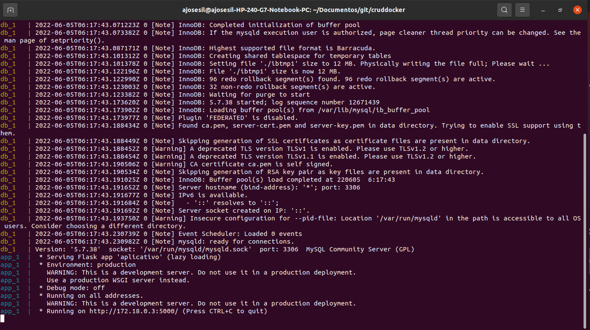
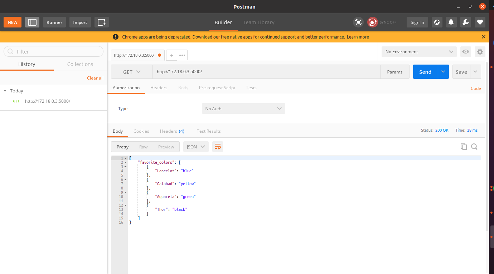

# docker api in python with mysql bank data
An example of  an simple web app based on Flask and MySQL and making it run with Docker and docker-compose.

### run docker terminal

### postman request

